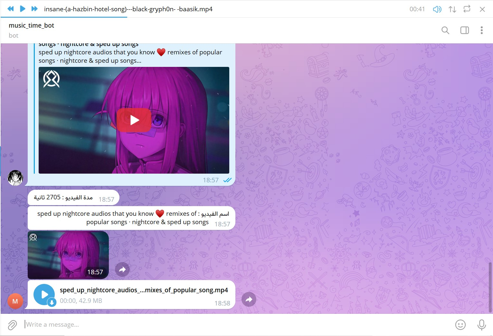

# telegram-bot-music

A telegram bot that can download music from youtube and upload to telegram.

## Usage

1. Install dependencies

by run 'npm i'

2. rename the .env.example to .env

3. fill the .env file

4. run 'node index.js'

then enjoy it!

the owner is @the_hybridv

